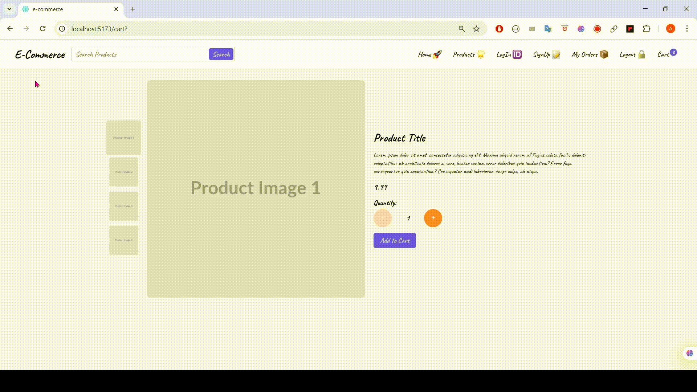
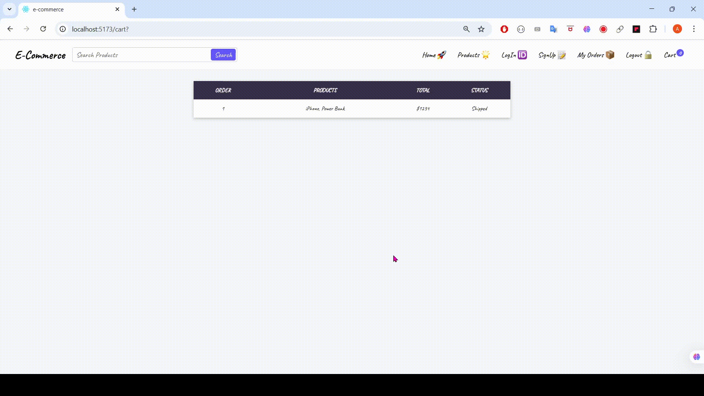
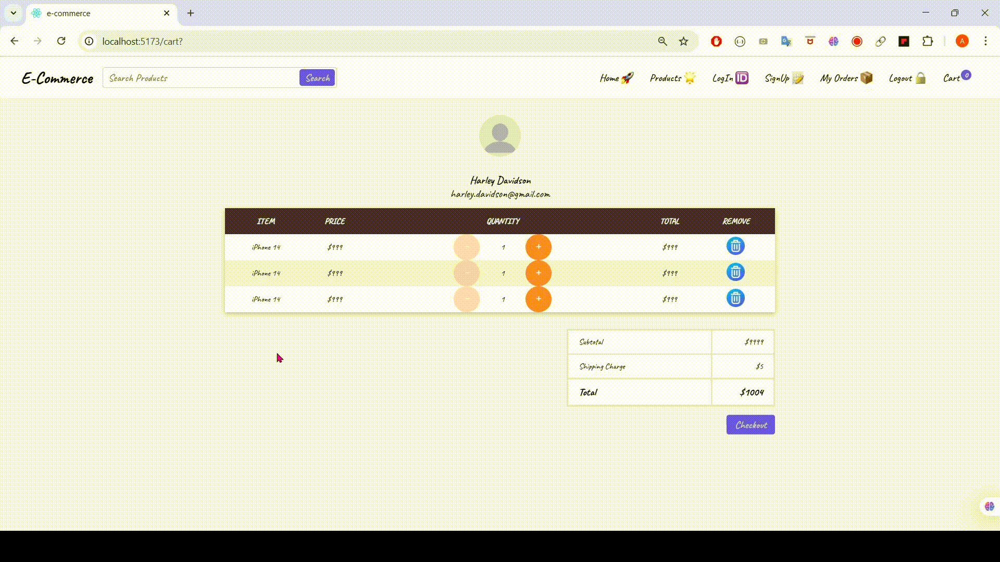
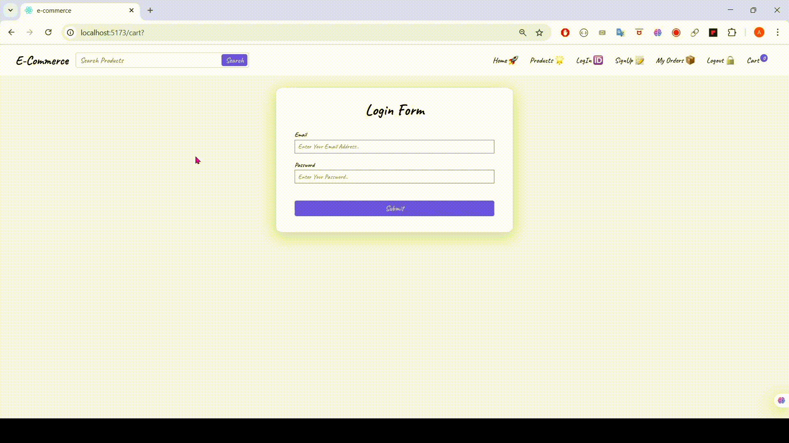

# 🛍️ React E-Commerce App

> A simple e-commerce frontend built using React. This project includes multiple pages such as Home, Products, Single Product, Cart, Login Page, and Signup Page. The project is still in progress with more features being developed.

---

## 🎞️ Live Preview (GIF)

### 🏠 Home Page  


### 🛍️ Products Page  


### 📄 Single Product Page  


### 📦 My Order Page  


### 🛒 Cart Page  


### 🔐 Login Page  


### 📝 Signup Page  


---

## ✅ Features Completed

- 🏠 Home Page  
- 🛍️ Product Listing Page  
- 📄 Single Product Detail Page  
- 🛒 Cart Page  
- 📦 My Order Page  
- 🧾 Submit Form Handling and Validation (Login Page and Signup Page)  
- 🔗 Integrated Axios to fetch category for Sidebar and products from Backend API (by category, page, and single product)  
- 🧭 Implemented React Router for page navigation  
- 🔢 Implemented Pagination  
- 🔄 Infinite Scrolling on Product Page  
- ⏳ Added Loading Indicator (Loader)
- 🔐 Integrated JWT-based Auth for Signup, Login, and Logout  
- 🔐 Integrated with protected backend APIs (login-required)  
- ➕ Implemented "Add to Cart" functionality (Cart Page and via Product Cards)  
- 🛒 Implemented fetching of user-added cart items  
- 🧠 Implemented useContext hook for state management  
- 💳 Implemented checkout functionality  
- 🛡️ Implemented protected routes  

---

## 🧪 In Development / Planned Features

- [ ] 🔄 Connecting to More Backend APIs  
- [ ] 💾 Caching and Persistence (React Query)

---

## 🛠️ Technologies Used

- [React](https://reactjs.org/)
- [Vite](https://vitejs.dev/)
- [React Router](https://reactrouter.com/)
- CSS
- HTML
- JavaScript
- LocalStorage
- [JSON Web Token (JWT)](https://jwt.io/)
- [Zod (Form Validation)](https://zod.dev/)
- [react-hook-form](https://react-hook-form.com/)
- [Axios](https://axios-http.com/)
- [React Query *(Planned)*](https://tanstack.com/query/latest/docs/framework/react/overview)

---

## 🚀 Getting Started

```bash
# Install dependencies
npm install

# Run development server
npm run dev

