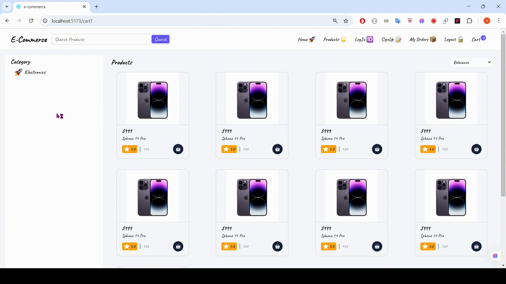

# 🛍️ React E-Commerce App

> A simple e-commerce frontend built using React. This project includes multiple pages such as Home, Products, Single Product, and Cart. The project is still in progress with more features being developed.

---

## 🎞️ Live Preview (GIF)

### 🏠 Home Page  


### 🛍️ Products Page  


### 📄 Single Product Page  


### 📦 My Order Page  


### 🛒 Cart Page  


---

## ✅ Features Completed

- 🏠 Home Page UI
- 🛍️ Product Listing Page
- 📄 Single Product Detail Page
- 🛒 Cart Page
- 📦 My Order Page

---

## 🧪 In Development / Planned Features

- [ ] 🧾 Submit Form Handling and Validation  
- [ ] 🔄 Connecting to Backend API  
- [ ] 🔐 Auth: Signup, Login, Logout  
- [ ] 🧭 Routing with React Router  
- [ ] 💾 Caching and Persistence (React Query)

---

## 🛠️ Technologies Used

- [React](https://reactjs.org/)
- [Vite](https://vitejs.dev/) *(optional)*
- React Router
- CSS
- HTML
- JavaScript
- LocalStorage
- React Query *(Planned)*

---

## 🚀 Getting Started

```bash
# Install dependencies
npm install

# Run development server
npm run dev

